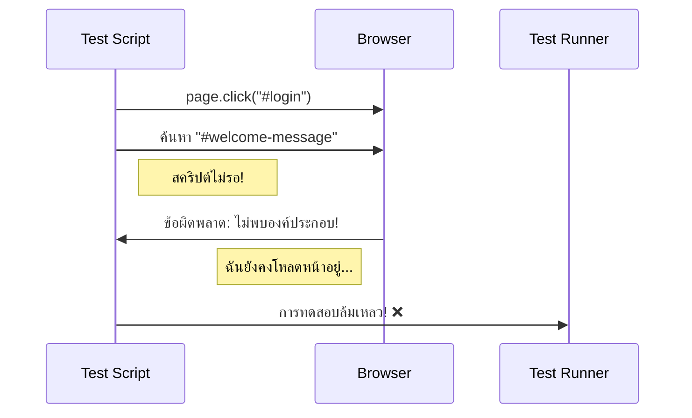
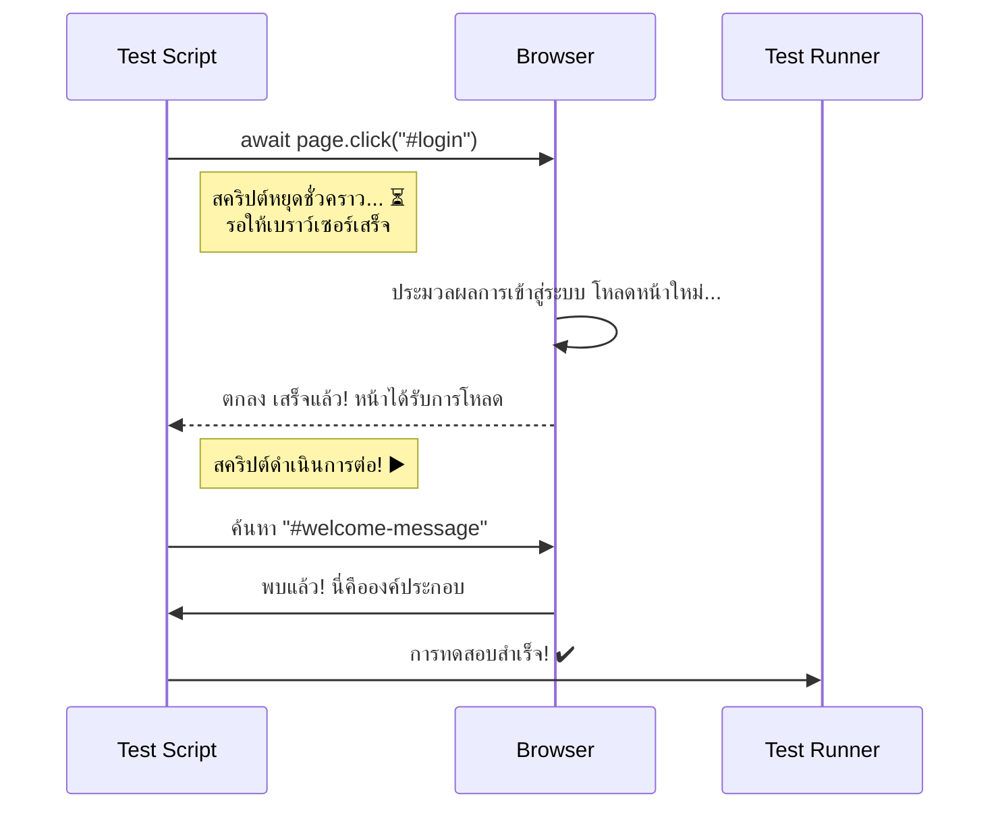

# การเขียนโปรแกรมพื้นฐานสำหรับผู้ทดสอบ

!!! warning "ข้อควรระวัง"
    บทความแปลด้วย AI อัตโนมัติ อาจมีข้อผิดพลาด ยังไม่ได้ตรวจทาน

ยินดีต้อนรับสู่การศึกษาเชิงลึก! ในโมดูลหลัก เราแนะนำแนวคิด "ขั้นต่ำ" ที่จำเป็น ที่นี่ เราจะขยายแนวคิดเหล่านั้นด้วยตัวอย่างที่ใช้งานได้จริงและเพิ่มเครื่องมือที่สำคัญใหม่ลงในชุดทักษะของคุณ เป้าหมายคือแสดงให้คุณเห็นไม่เพียงแต่ *อะไร* พวกมัน แต่ *ทำไม* พวกมันจึงจำเป็นสำหรับการทดสอบอัตโนมัติ

## **1. ตัวแปร: เก็บหลักฐานของคุณ**

ดังที่เรากล่าวไป ตัวแปรคือกล่องที่มีป้ายกำกับสำหรับเก็บข้อมูล ในการทดสอบ คุณจะใช้ตัวแปรอย่างต่อเนื่องเพื่อเก็บข้อมูลที่คุณดึงมาจากเว็บไซต์เพื่อตรวจสอบว่าถูกต้อง

| ประเภทข้อมูล | คำอธิบาย | สถานการณ์ทดสอบ | ตัวอย่างโค้ด |
| :--- | :--- | :--- | :--- |
| **String (สตริง)** | ข้อความชิ้นหนึ่ง | เก็บข้อความยินดีต้อนรับหลังจากเข้าสู่ระบบเพื่อตรวจสอบว่าระบุว่า "ยินดีต้อนรับ ผู้ใช้!" | `let welcomeMessage = await page.textContent("#welcome-banner");` |
| **Number (ตัวเลข)** | ตัวเลขทั้งหมดหรือทศนิยม | เก็บจำนวนรายการในตะกร้าสินค้า | `let itemCount = await page.locator(".cart-item").count();` |
| **Boolean (บูลีน)** | ค่า `true` หรือ `false` ง่ายๆ | ตรวจสอบว่าข้อความข้อผิดพลาดมองเห็นได้บนหน้า | `let isErrorVisible = await page.isVisible("#login-error");` |

**ทำไมนี่จึงสำคัญสำหรับการทดสอบ:** การทดสอบของคุณไม่ได้เพียงแค่เกี่ยวกับการคลิกปุ่ม มันเกี่ยวกับการสร้าง **ข้อความยืนยัน** คุณจะเก็บผลลัพธ์จริงจากเว็บไซต์ไว้ในตัวแปร และจากนั้นเปรียบเทียบกับผลลัพธ์ที่คาดไว้

## **2. เงื่อนไข: ทางเลือกที่แยกออกมา**

เงื่อนไขเป็นแนวคิดที่จำเป็นหรือไม่? **ใช่ อย่างแน่นอน** การทดสอบอัตโนมัติมักต้องการตัดสินใจ เช่นเดียวกับสิ่งที่ผู้ทดสอบด้วยตนเองจะทำ เงื่อนไขช่วยให้สคริปต์ของคุณเลือกเส้นทางที่แตกต่างกันตามสิ่งที่มองเห็นบนหน้า

ลองคิดว่ามันเป็นทางแยก คุณใช้คำสั่ง `if` เพื่อตรวจสอบเงื่อนไข
*   **`if`** (ถ้า) เงื่อนไขเป็น `true` คุณไปทางหนึ่ง
*   **`else`** (ไม่เช่นนั้น) คุณไปทางอื่น

นี่สำคัญอย่างยิ่งต่อการสร้างการทดสอบที่แข็งแกร่งซึ่งไม่ล้มเหลวได้ง่าย

**สถานการณ์ตัวอย่าง:** ลองนึกภาพปุ่ม "ลบ" ที่แสดงป๊อปอัปยืนยัน การทดสอบของคุณต้องตรวจสอบว่าป๊อปอัปปรากฏขึ้นหรือไม่ แล้วคลิก "ตกลง"

```javascript
// คลิกปุ่มลบหลัก
await page.click("#delete-item-button");

// ใช้เงื่อนไขเพื่อตรวจสอบว่าป๊อปอัปยืนยันปรากฏขึ้นหรือไม่
const isPopupVisible = await page.isVisible("#confirm-popup");

if (isPopupVisible) {
  // เส้นทางนี้ทำงานเฉพาะเมื่อป๊อปอัปมองเห็นได้
  console.log("ป๊อปอัปยืนยันปรากฏขึ้น กำลังคลิกตกลง");
  await page.click("#confirm-ok-button");
} else {
  // เส้นทางนี้ทำงานถ้าป๊อปอัปไม่ปรากฏ
  console.log("ข้อผิดพลาด: ป๊อปอัปยืนยันไม่ปรากฏ!");
  // ที่นี่คุณมักจะทำให้การทดสอบล้มเหลว
}
```

หากไม่มีเงื่อนไข สคริปต์ของคุณจะพยายามคลิกปุ่ม "ตกลง" ตามตรงและจะขัดข้องหากป๊อปอัปไม่เคยปรากฏ ทำให้เกิดข้อความข้อผิดพลาดที่ชัดเจนน้อยกว่า

## **3. Locators (ตัวค้นหา): GPS ของคุณสำหรับการค้นหาองค์ประกอบเว็บ**

ก่อนที่คุณจะสามารถโต้ตอบกับองค์ประกอบได้ คุณต้องค้นหามันก่อน Locators (หรือ selectors) คือคำสั่งที่คุณให้แก่เครื่องมือทดสอบของคุณเพื่อค้นหาองค์ประกอบที่ไม่ซ้ำกันบนหน้า

### **CSS Selectors (ตัวเลือก CSS)**

CSS Selectors เป็นวิธีที่ใช้บ่อยที่สุดและทรงพลังที่สุดในการค้นหาองค์ประกอบ พวกมันใช้ไวยากรณ์เดียวกันที่นักพัฒนาใช้ในการใช้สไตล์ (CSS) นี่คือสิ่งที่คุณจะใช้ 95% ของเวลา

| ประเภท Selector | ไวยากรณ์ | ตัวอย่าง HTML | โค้ด Locator |
| :--- | :--- | :--- | :--- |
| **ID** | `#id` | `<button id="main-login-btn">Login</button>` | `"#main-login-btn"` |
| **Class** | `.classname` | `<p class="error-message">Invalid.</p>` | `".error-message"` |
| **Attribute** | `[attr="val"]` | `<input name="username" />` | `"[name='username']"` |
| **Test ID** | `[data-testid="val"]` | `<a data-testid="forgot-password">...</a>` | `"[data-testid='forgot-password']"` |

**เคล็ดลับ:** นักพัฒนามักเพิ่มแอตทริบิวต์พิเศษเช่น `data-testid` โดยเฉพาะสำหรับการทดสอบอัตโนมัติ สิ่งเหล่านี้คือ locators ที่ดีที่สุดที่จะใช้ เพราะมีโอกาสน้อยที่จะเปลี่ยนแปลงแม้ว่าสไตล์ของเว็บไซต์จะอัปเดต

??? note "Locators ขั้นสูง: ใช้ความสัมพันธ์กับ CSS Combinators"

    บางครั้ง องค์ประกอบที่คุณต้องการกำหนดเป้าหมายไม่มี locator ที่ดีและไม่ซ้ำกัน อย่างไรก็ตาม องค์ประกอบที่อยู่ใกล้เคียง เช่น element ที่เป็นพ่อแม่หรือพี่น้อง *มี* locator ที่ดี CSS Combinators ให้คุณใช้องค์ประกอบที่อยู่ใกล้เคียงนั้นเป็น "จุดยึด" เพื่อค้นหาองค์ประกอบที่คุณต้องการ

    คิดเหมือนว่าให้ทิศทาง: "ค้นหาบ้านสีแดงใหญ่ที่มุม แล้วบ้านของฉันคือบ้านที่อยู่ถัดไป"

    นี่คือ combinators ที่ใช้บ่อยที่สุดที่คุณจะใช้ในการทดสอบ

    | Combinator | ชื่อ | ไวยากรณ์ | ตัวอย่างและความหมาย |
    | :--- | :--- | :--- | :--- |
    | (ช่องว่าง) | **Descendant (ลูกหลาน)** | `ancestor descendant` | `div#user-profile p` <br/> *เลือกองค์ประกอบ `<p>` ใด ๆ ที่อยู่ **ที่ไหนสักแห่งภายใน** `<div>` ที่มี id `user-profile` มันอาจเป็นลูกโดยตรง ลูกของลูก ฯลฯ* |
    | `>` | **Child (ลูก)** | `parent > child` | `ul.main-menu > li` <br/> *เลือกเฉพาะองค์ประกอบ `<li>` ที่เป็น **ลูกโดยตรง** ของ `<ul>` ที่มี class `main-menu`* |
    | `+` | **Adjacent Sibling (พี่น้องที่อยู่ติดกัน)** | `element + next_element` | `h2 + p` <br/> *เลือกองค์ประกอบ `<p>` ตัวแรกที่อยู่ **ทันทีหลัง** องค์ประกอบ `<h2>`* |

    #### **เมื่อไหร่ที่คุณจะใช้สิ่งเหล่านี้ในการทดสอบ?**

    สิ่งเหล่านี้ไม่ใช่เพียงแนวคิดทางทฤษฎี พวกมันแก้ปัญหาการทดสอบในโลกแห่งความเป็นจริง

    **สถานการณ์ที่ 1: การค้นหา label สำหรับฟิลด์ input เฉพาะ**

    ลองนึกภาพฟอร์มที่ labels ไม่มี IDs ที่ไม่ซ้ำกัน แต่ input fields มี

    ```html
    <div class="form-group">
      <label>ชื่อจริง</label>
      <input id="first-name-input" type="text">
    </div>
    <div class="form-group">
      <label>นามสกุล</label>
      <input id="last-name-input" type="text">
    </div>
    ```

    **ปัญหา:** คุณจะตรวจสอบข้อความ label สำหรับฟิลด์ "นามสกุล" ได้อย่างไร?
    **วิธีแก้ไข:** ใช้ adjacent sibling combinator แต่เนื่องจาก `label` มาก่อน `input` คุณจึงไม่สามารถใช้ `+` ได้ แทนที่จะเป็นเช่นนั้น คุณสามารถยึดองค์ประกอบพ่อแม่ร่วมของพวกมันได้

    หากคุณต้องใช้ pure CSS selector เพื่อจับ *parent* div คุณสามารถทำแบบนี้: `div:has(#last-name-input)` แล้วค้นหา label ภายในนั้น (หมายเหตุ: `:has()` เป็นคุณสมบัติ CSS ใหม่ที่ทรงพลังมาก)

    ให้ใช้ตัวอย่างที่ชัดเจนกว่าสำหรับ combinators

    **สถานการณ์ที่ 2: การคลิกปุ่ม "ดูรายละเอียด" สำหรับผู้ใช้เฉพาะในตาราง**

    ลองนึกภาพตารางของผู้ใช้ แต่ละแถวมีชื่อผู้ใช้และปุ่ม "ดูรายละเอียด" ปุ่มเองไม่มี IDs ที่ไม่ซ้ำกัน

    ```html
    <tr id="user-row-123">
      <td class="username">Alice</td>
      <td>alice@example.com</td>
      <td><button class="view-details">ดูรายละเอียด</button></td>
    </tr>
    <tr id="user-row-456">
      <td class="username">Bob</td>
      <td>bob@example.com</td>
      <td><button class="view-details">ดูรายละเอียด</button></td>
    </tr>
    ```

    **ปัญหา:** คุณจะคลิกปุ่ม "ดูรายละเอียด" โดยเฉพาะสำหรับ Alice ได้อย่างไร?
    **วิธีแก้ไข:** ใช้ **Descendant Combinator** คุณค้นหาแถวของ Alice ที่ไม่ซ้ำกัน แล้วค้นหาปุ่ม *ที่ลงมาจากนั้น*

    ```javascript
    // "ค้นหาปุ่มที่มี class 'view-details' ที่อยู่ที่ไหนสักแห่งภายใน
    //  องค์ประกอบที่มี id 'user-row-123'"
    const alicesButtonSelector = "#user-row-123 .view-details";

    await page.click(alicesButtonSelector);
    ```

    **คำเตือน:** การใช้ combinators ที่ซับซ้อนมากเกินไปอาจนำไปสู่ **การทดสอบที่เปราะบาง** ถ้านักพัฒนาเปลี่ยนแปลงโครงสร้าง HTML เล็กน้อย (เช่น ห่อองค์ประกอบใหม่ใน `<div>`) selector เช่น `div > a` อาจพัง ในขณะที่ selector ที่ใช้ `data-testid` จะไม่เสียหาย

    **สรุป:** ใช้คุณสมบัติ combinators เมื่อจำเป็น มันเป็นเครื่องมือที่ทรงพลังสำหรับแก้ปัญหา locator ที่พบบ่อยและน่าหงุดหงิด

### **XPath (XML Path Language)**

บางครั้ง องค์ประกอบนั้นหาได้ยากด้วย CSS Selector บางทีมันอาจไม่มี ID หรือ class ที่ไม่ซ้ำกัน XPath เป็นอีกกลยุทธ์ locator ที่ทรงพลังมากซึ่งทำงานโดยอธิบายเส้นทางไปยังองค์ประกอบผ่านโครงสร้าง HTML (DOM)

| กลยุทธ์ XPath | คำอธิบาย | ตัวอย่างโค้ด Locator |
| :--- | :--- | :--- |
| **Attribute Match (จับคู่แอตทริบิวต์)** | ค้นหา tag ใด ๆ (`*`) ที่มีแอตทริบิวต์เฉพาะ | `//*[@id='main-login-btn']` |
| **Find by Text (ค้นหาตามข้อความ)** | ค้นหาองค์ประกอบที่มีข้อความที่มองเห็นได้เฉพาะ สิ่งนี้มีประโยชน์อย่างมากแต่อาจเปราะบางหากข้อความเปลี่ยนแปลง | `//*[text()='Click Me']` |
| **Contains Text (มีข้อความ)** | วิธีที่ยืดหยุ่นมากขึ้นในการค้นหาตามข้อความ | `//*[contains(text(), 'ยินดีต้อนรับกลับมา')]` |

ใช้ CSS selectors ก่อน หันไปใช้ XPath เฉพาะเมื่อคุณมีสถานการณ์ที่ซับซ้อนซึ่ง CSS ไม่สามารถจัดการได้อย่างง่ายดาย

## **4. Async/Await: คำอธิบายร้านกาแฟ**

ดังที่เราได้กล่าวไป `async/await` คือวิธีที่เราบอกสคริปต์ของเราให้หยุดชั่วคราวและรอให้เว็บไซต์เสร็จภารกิจของมันก่อนที่จะไปต่อ แผนภาพช่วยทำให้แนวคิดนี้ชัดเจนขึ้นมาก

### **ปัญหา: สคริปต์ Synchronous (ไม่มี `await`)**

สคริปต์นี้ไม่รอ มันคลิกปุ่มเข้าสู่ระบบและ *ทันที* พยายามค้นหาข้อความ "ยินดีต้อนรับ" เว็บไซต์ยังไม่มีเวลาโหลดหน้าถัดไป ดังนั้นการทดสอบจึงล้มเหลว



### **วิธีแก้ไข: สคริปต์ Asynchronous (มี `await`)**

สคริปต์นี้ใช้ `await` มันคลิกปุ่มเข้าสู่ระบบ แล้วจึง *หยุดชั่วคราว* รอให้เบราว์เซอร์ส่งสัญญาณว่าคำสั่งเสร็จสมบูรณ์ (กล่าวคือ หน้าถัดไปได้รับการโหลด) จากนั้นสคริปต์จึงดำเนินการต่อและค้นหาข้อความ "ยินดีต้อนรับ"



เกือบทุกการโต้ตอบกับหน้าเว็บในการทดสอบ—การคลิก การพิมพ์ การอ่านข้อความ—จะต้องใช้คีย์เวิร์ด `await` นี่คือแนวคิดที่สำคัญที่สุดเพียงแนวคิดเดียวสำหรับการป้องกันการทดสอบที่ไม่เสถียรและไม่น่าเชื่อถือ
