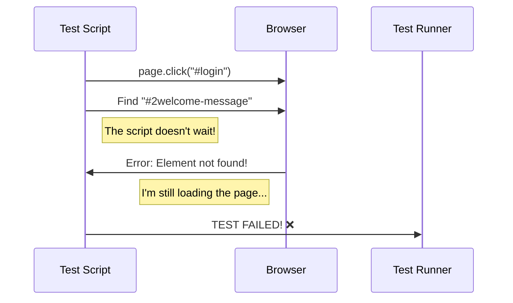
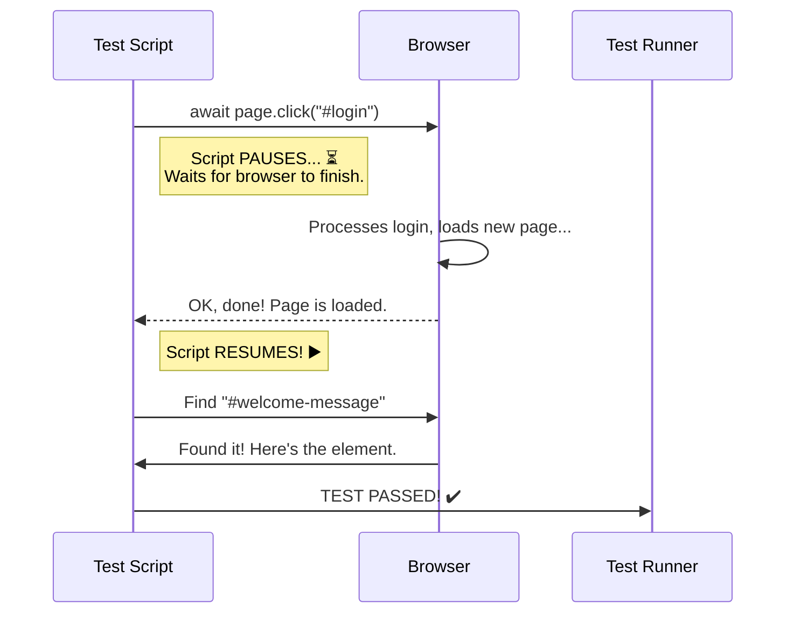

# More about programming

Welcome to the deeper dive! In the main module, we introduced the "bare minimum" concepts. Here, we'll expand on them with more practical examples and add a crucial new tool to your kit. The goal is to show you not just *what* they are, but *why* they are essential for automated testing.

### **1. Variables: Storing Your Evidence**

As we covered, variables are labeled boxes for storing information. In testing, you'll use them constantly to store data you retrieve from the website to check if it's correct.

| Data Type | Description | Example Test Scenario | Code Example |
| :--- | :--- | :--- | :--- |
| **String** | A piece of text. | Store the welcome message after login to verify it says "Welcome, User!" | `let welcomeMessage = await page.textContent("#welcome-banner");` |
| **Number** | A whole number or decimal. | Store the number of items in a shopping cart. | `let itemCount = await page.locator(".cart-item").count();` |
| **Boolean** | A simple `true` or `false` value. | Check if an error message is visible on the page. | `let isErrorVisible = await page.isVisible("#login-error");` |

**Why this matters for testing:** Your test isn't just about clicking buttons; it's about making **assertions**. You'll store the actual result from the website in a variable and then compare it to your expected result.

### **2. Conditions: The Fork in the Road**

Is the concept of "conditions" necessary? **Yes, absolutely.** Automated tests often need to make decisions, just like a manual tester would. A condition allows your script to take a different path based on what it sees on the page.

Think of it as a fork in the road. You use an `if` statement to check a condition.
*   **`if`** the condition is `true`, you go down one path.
*   **`else`**, you go down the other.

This is critical for building robust tests that don't fail brittlely.

**Example Scenario:** Imagine a "Delete" button that shows a confirmation pop-up. Your test needs to check if the pop-up appears and then click "OK".

```javascript
// Click the main delete button
await page.click("#delete-item-button");

// Use a condition to check if the confirmation pop-up appeared
const isPopupVisible = await page.isVisible("#confirm-popup");

if (isPopupVisible) {
  // This path runs ONLY if the popup is visible
  console.log("Confirmation popup appeared. Clicking OK.");
  await page.click("#confirm-ok-button");
} else {
  // This path runs if the popup did NOT appear
  console.log("ERROR: Confirmation popup did not appear!");
  // Here you would typically fail the test
}
```

Without conditions, your script would blindly try to click the "OK" button and would crash if the pop-up never appeared, giving you a less clear error message.

### **3. Locators: Your GPS for Finding Web Elements**

Before you can interact with an element, you must find it. Locators (or selectors) are the instructions you give your testing tool to find a unique element on the page.

#### **CSS Selectors**

CSS Selectors are the most common and powerful way to find elements. They use the same syntax that developers use to apply styles (CSS). Here are the ones you will use 95% of the time.

| Selector Type | Syntax | HTML Example | Locator Code |
| :--- | :--- | :--- | :--- |
| **ID** | `#id` | `<button id="main-login-btn">Login</button>` | `"#main-login-btn"` |
| **Class** | `.classname` | `<p class="error-message">Invalid.</p>` | `".error-message"` |
| **Attribute** | `[attr="val"]` | `<input name="username" />` | `"[name='username']"` |
| **Test ID** | `[data-testid="val"]` | `<a data-testid="forgot-password">...</a>` | `"[data-testid='forgot-password']"` |

??? note "Advanced Locators: Using Relationships with CSS Combinators"

    Sometimes, the element you want to target doesn't have a good, unique locator. However, a nearby element—like its parent or a sibling—*does*. CSS Combinators let you use that nearby element as an "anchor" to find the element you need.

    Think of it like giving directions: "Find the big red house on the corner, and then my house is the one right next to it."

    Here are the most common combinators you'll use in testing.

    | Combinator | Name | Syntax | Example & Meaning |
    | :--- | :--- | :--- | :--- |
    | (space) | **Descendant** | `ancestor descendant` | `div#user-profile p` <br/> *Selects any `<p>` element that is **somewhere inside** the `<div>` with the id `user-profile`. It could be a direct child, a grandchild, etc.* |
    | `>` | **Child** | `parent > child` | `ul.main-menu > li` <br/> *Selects only `<li>` elements that are **direct children** of the `<ul>` with the class `main-menu`.* |
    | `+` | **Adjacent Sibling** | `element + next_element` | `h2 + p` <br/> *Selects the first `<p>` element that is **immediately after** an `<h2>` element.* |

    #### **When Would You Use These in a Test?**

    These are not just theoretical concepts; they solve real-world testing problems.

    **Scenario 1: Finding a label for a specific input field.**

    Imagine a form where the labels don't have unique IDs, but the input fields do.

    ```html
    <div class="form-group">
      <label>First Name</label>
      <input id="first-name-input" type="text">
    </div>
    <div class="form-group">
      <label>Last Name</label>
      <input id="last-name-input" type="text">
    </div>
    ```

    **Problem:** How do you verify the text of the label for the "Last Name" field?
    **Solution:** Use the adjacent sibling combinator. But since the `label` comes *before* the `input`, you can't use `+`. Instead, you can anchor on their shared parent.

    *   A better approach is to find the input and then find the label relative to it (many testing tools allow this).
    *   However, if you must use a pure CSS selector to grab the *parent* div, you could do it like this: `div:has(#last-name-input)` and then find the label within it. (Note: `:has()` is a newer, very powerful CSS feature).

    Let's use a clearer example for combinators.

    **Scenario 2: Clicking the "View Details" button for a specific user in a table.**

    Imagine a table of users. Each row has a username and a "View Details" button. The buttons themselves have no unique IDs.

    ```html
    <tr id="user-row-123">
      <td class="username">Alice</td>
      <td>alice@example.com</td>
      <td><button class="view-details">View Details</button></td>
    </tr>
    <tr id="user-row-456">
      <td class="username">Bob</td>
      <td>bob@example.com</td>
      <td><button class="view-details">View Details</button></td>
    </tr>
    ```

    **Problem:** How do you click the "View Details" button specifically for Alice?
    **Solution:** Use the **Descendant Combinator**. You find Alice's unique row and then find the button *descended* from it.

    ```javascript
    // "Find a button with class 'view-details' that is somewhere inside
    //  an element with the id 'user-row-123'"
    const alicesButtonSelector = "#user-row-123 .view-details";

    await page.click(alicesButtonSelector);
    ```

    **A Word of Caution:** Overusing complex combinators can lead to **brittle tests**. If a developer slightly changes the HTML structure (e.g., wraps an element in a new `<div>`), a selector like `div > a` might break, whereas a selector using a `data-testid` would not.

    **Verdict:** Include this section. It introduces a slightly more advanced topic in a controlled way and gives your learners a powerful tool to solve common and frustrating locator problems. It bridges the gap between "beginner" and "capable."

**Pro Tip:** Developers often add special attributes like `data-testid` specifically for automation. These are the best locators to use because they are unlikely to change even if the website's style is updated.

#### **XPath (XML Path Language)**

Sometimes, an element is hard to find with a CSS Selector. Maybe it doesn't have a unique ID or class. XPath is another, very powerful locator strategy that works by describing the path to an element through the HTML structure (the DOM).

| XPath Strategy | Description | Example Locator Code |
| :--- | :--- | :--- |
| **Attribute Match** | Finds any tag (`*`) with a specific attribute. | `//*[@id='main-login-btn']` |
| **Find by Text** | Finds an element that contains specific, visible text. This is extremely useful but can be brittle if the text changes. | `//*[text()='Click Me']` |
| **Contains Text** | A more flexible way to find by text. | `//*[contains(text(), 'Welcome back')]` |

Use CSS selectors first. Only turn to XPath when you have a complex situation that CSS can't easily handle.

### **4. Async/Await: The Coffee Shop, Visualized**

As we discussed, `async/await` is how we tell our script to pause and wait for the website to finish a task before moving on. A diagram makes this concept much clearer.

#### **The Problem: A Synchronous Script (Without `await`)**

This script doesn't wait. It clicks the login button and *immediately* tries to find the "Welcome" message. The website hasn't had time to load the next page, so the test fails.



#### **The Solution: An Asynchronous Script (With `await`)**

This script uses `await`. It clicks the login button and then *pauses*, waiting for the browser to signal that the command is complete (i.e., the next page has loaded). Only then does it resume and look for the "Welcome" message.



Nearly every interaction with a webpage in a test—clicking, typing, reading text—will need the `await` keyword in front of it. This is the single most important concept for preventing flaky, unreliable tests.
